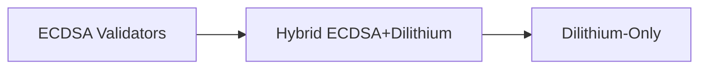

# Fluentum Core

[](https://golang.org/)
[](LICENSE)
[](https://github.com/fluentum-chain/fluentum/commits/main)
[](https://github.com/fluentum-chain/fluentum)
[](https://cometbft.com/)
[](https://cosmos.network/)
[](FINAL_CHECKLIST.md)

> **⚠️ NOTICE: This codebase is now fully migrated to CometBFT v0.38+ and ABCI 2.0 (ABCI++).**
>
> - All ABCI interfaces, types, and methods now use the new ABCI 2.0 (ABCI++) model.
> - Legacy methods (`BeginBlock`, `DeliverTx`, `EndBlock`, etc.) and types (`ResponseDeliverTx`, etc.) have been removed. Now uses `FinalizeBlock` for block-level transaction processing.
> - All block execution and event logic now uses `FinalizeBlock`, `ExecTxResult`, and the new event structure.
> - If you are upgrading from Tendermint/ABCI 1.0, **read the migration notes below** and update your application, tests, and integrations accordingly.
> - See the [Migration Guide](#migration-guide) and [docs/abci/README.md](abci/README.md) for details.

> **Next-Generation Hybrid Blockchain Platform** - High-performance, quantum-resistant, and privacy-enabled blockchain with cross-chain interoperability.

## 🚀 Overview

Fluentum Core is a production-ready blockchain platform that combines **Delegated Proof of Stake (DPoS)** with **Zero-Knowledge Rollups (ZK-Rollups)** for unprecedented performance and security. Built on **CometBFT v0.38.6** consensus with quantum-resistant cryptography and cross-chain capabilities.

### Key Differentiators

1. **🔄 Hybrid Consensus**: DPoS + ZK-Rollups for scalability and security
2. **🔐 Quantum-Resistant**: Post-quantum cryptography (Dilithium signatures)
3. **🌐 Cross-Chain**: Native interoperability with EVM and SVM chains
4. **⚡ High Performance**: Optimized for 10,000+ TPS
5. **🔒 Privacy**: Zero-knowledge proof integration
6. **🎯 Enterprise Ready**: Production-grade with comprehensive tooling
7. **🚀 ABCI++**: Full support for CometBFT's ABCI++ features

## 🔄 Migration to CometBFT

This project has been successfully migrated from Tendermint Core to **CometBFT v0.38.6** with **Cosmos SDK v0.50.6**. 

### Key Migration Changes

- ✅ **CometBFT v0.38.6**: Drop-in replacement for Tendermint v0.34+ (Go 1.24 compatible)
- ✅ **Cosmos SDK v0.50.6**: Compatible SDK version for CometBFT v0.38.6
- ✅ **cometbft-db v0.9.1**: Compatible database backend
- ✅ **ABCI++ Support**: `PrepareProposal`, `ProcessProposal`, `ExtendVote`, `VerifyVoteExtension`
- ✅ **Proposer-Based Timestamps (PBTS)**: Enhanced timestamp handling
- ✅ **Nop Mempool**: Application-managed transaction handling
- ✅ **Pebble Database**: High-performance storage backend
- ✅ **Environment Variables**: `TMHOME` → `CMTHOME`

### Quick Migration

```bash
# Automatic migration (Linux/macOS)
chmod +x scripts/migrate-config.sh
./scripts/migrate-config.sh

# Windows PowerShell
.\scripts\migrate-config.ps1

# Manual migration
go install github.com/cometbft/confix@latest
confix migrate --home ~/.cometbft --target-version v0.38.6
```

For detailed migration instructions, see [Migration Guide](#migration-guide) below.

## 📊 Project Statistics

| Metric | Value |
|--------|-------|
| **Repository Size** | ~150 MB (compressed) |
| **Source Code** | ~60 MB (uncompressed) |
| **Go Files** | 682 files (~5.4 MB) |
| **Total Files** | 1,205 files |
| **Directories** | 319 |
| **Git Commits** | 8,761+ |
| **Languages** | Go (82.2%), Solidity (2.6%), TeX (6.7%) |
| **CometBFT Version** | v0.38.6 |
| **Cosmos SDK Version** | v0.50.6 |
| **cometbft-db Version** | v0.9.1 |

### Architecture Components

```
fluentum/
├── 📁 consensus/          # Hybrid consensus (DPoS + ZK-Rollups)
├── 📁 crypto/             # Quantum-resistant cryptography
├── 📁 fluentum/           # Core Fluentum-specific modules
├── 📁 contracts/          # Smart contracts (Solidity)
├── 📁 circuits/           # Zero-knowledge circuits
├── 📁 cmd/fluentum/       # Main executable
├── 📁 docs/               # Comprehensive documentation
├── 📁 scripts/            # Migration and utility scripts
└── 📁 networks/           # Network configurations
```

## 🚀 Quick Start

### Prerequisites

**⚠️ Important: Go Version Requirements**

The project currently supports Go 1.24.4+:

```bash
# Verify Go version
go version
# Expected: go version go1.24.4 linux/amd64

# Install Go 1.24.4
wget https://go.dev/dl/go1.24.4.linux-amd64.tar.gz
sudo rm -rf /usr/local/go && sudo tar -C /usr/local -xzf go1.24.4.linux-amd64.tar.gz
export PATH=$PATH:/usr/local/go/bin
```

**Note**: The project requires Go 1.24.4+ for compatibility with CometBFT v0.38.6 and Cosmos SDK v0.50.6.

### System Requirements
- **Go**: 1.24.4+ (required)
- **Git**: Latest version
- **System**: Ubuntu 20.04+ (recommended) or Windows/macOS

### 🚀 Automated Installation (Ubuntu)

```bash
# Clone the repository
git clone https://github.com/fluentum-chain/fluentum.git
cd fluentum

# Run automated installation
chmod +x install-ubuntu.sh
./install-ubuntu.sh
```

### 🔧 Manual Installation

```bash
# Clone the repository
git clone https://github.com/fluentum-chain/fluentum.git
cd fluentum

# Install dependencies (pinned for Go 1.20 compatibility)
go mod tidy

# Build with CometBFT and PebbleDB
make build

# Initialize a new node
./build/fluentumd init --home ~/.cometbft

# Start the node
./build/fluentumd start --home ~/.cometbft
```

### ✅ Verify Installation

```bash
# Check version
./build/fluentumd version

# Initialize a new node
./build/fluentumd init --home ~/.cometbft

# Start the node
./build/fluentumd start --home ~/.cometbft

# Show all commands
./build/fluentumd --help
```

## 🔧 Dependency Management

### Current Dependency Versions

The project uses pinned dependency versions for optimal compatibility:

| Dependency | Version | Go Compatibility |
|------------|---------|------------------|
| **CometBFT** | v0.38.6 | Go 1.24+ |
| **Cosmos SDK** | v0.50.6 | Go 1.24+ |
| **gRPC** | v1.73.0 | Go 1.24+ |
| **golang.org/x/exp** | v0.0.0-20231110203233-9a3e6036ecaa | Go 1.24+ |
| **golang.org/x/sys** | v0.15.0 | Go 1.24+ |
| **cosmossdk.io/log** | v1.3.1 | Go 1.24+ |
| **cosmossdk.io/store** | v1.1.0 | Go 1.24+ |

### Upgrading Dependencies

The project is currently configured for Go 1.24.4+ compatibility. To use newer dependencies:

```bash
# 1. Ensure Go 1.24.4+ is installed
go version

# 2. Update dependencies
go mod tidy

# 3. Rebuild
make build
```

**Note**: The project requires Go 1.24.4+ for compatibility with CometBFT v0.38.6 and Cosmos SDK v0.50.6.

## 🚀 Mainnet Deployment

### Production Readiness

Fluentum Core is now **mainnet-ready** with comprehensive deployment documentation:

- **[FINAL_CHECKLIST.md](FINAL_CHECKLIST.md)** - Complete deployment checklist
- **[QUICK_DEPLOYMENT_GUIDE.md](QUICK_DEPLOYMENT_GUIDE.md)** - Essential deployment steps
- **[DEPLOYMENT_SUMMARY.md](DEPLOYMENT_SUMMARY.md)** - Overview of all resources
- **[VERSION_COMPATIBILITY.md](VERSION_COMPATIBILITY.md)** - Version compatibility guide

### Deployment Scripts

- **[scripts/backup_fluentum.sh](scripts/backup_fluentum.sh)** - Linux/macOS backup automation
- **[scripts/backup_fluentum.ps1](scripts/backup_fluentum.ps1)** - Windows PowerShell backup
- **[scripts/health_check.sh](scripts/health_check.sh)** - Node health verification

### Quick Deployment

```bash
# 1. Follow the quick deployment guide
# See: QUICK_DEPLOYMENT_GUIDE.md

# 2. Run backup before deployment
./scripts/backup_fluentum.sh

# 3. Deploy and verify
./scripts/health_check.sh
```

## 🔄 Migration Guide

### For Existing Users

If you're upgrading from a previous version with Tendermint Core:

#### 1. Automatic Migration (Recommended)

**Linux/macOS:**
```bash
chmod +x scripts/migrate-config.sh
./scripts/migrate-config.sh
```

**Windows:**
```powershell
.\scripts\migrate-config.ps1
```

#### 2. Manual Migration

```bash
# 1. Install confix
go install github.com/cometbft/confix@latest

# 2. Set environment variables
export CMTHOME="$HOME/.cometbft"
export TMHOME="$HOME/.tendermint"

# 3. Migrate configuration
confix migrate --home $CMTHOME --target-version v0.38.6

# 4. Update dependencies
go mod tidy

# 5. Rebuild
make build
```

#### 3. Environment Variables

Update your shell profile:

```bash
# Remove old TMHOME
unset TMHOME

# Add new CMTHOME
export CMTHOME="$HOME/.cometbft"
```

**Windows:**
```powershell
# Remove TMHOME
[Environment]::SetEnvironmentVariable("TMHOME", $null, "User")

# Add CMTHOME
[Environment]::SetEnvironmentVariable("CMTHOME", "$env:USERPROFILE\.cometbft", "User")
```

### Configuration Changes

Key configuration updates in `config/config.toml`:

```toml
# Database backend (now pebble)
db_backend = "pebble"

# Mempool (now nop for application-managed transactions)
[mempool]
version = "nop"
recheck = false
broadcast = false

# Consensus with PBTS
[consensus]
pbts_enable = true
signature_scheme = "ed25519"
timeout_commit = "5s"

# Quantum features
[quantum]
enabled = true
mode = "dilithium3"
```

## 🎯 Core Features

### 🔄 Hybrid Consensus Engine
- **DPoS**: Delegated Proof of Stake for fast finality
- **ZK-Rollups**: Zero-knowledge proofs for scalability
- **Hybrid Router**: Intelligent transaction routing
- **ABCI++**: Full CometBFT ABCI++ support

### 🔐 Quantum-Resistant Security
- **Dilithium Signatures**: Post-quantum cryptography
- **Lattice-Based Crypto**: Future-proof security
- **Multi-Signature Support**: Enhanced security models

### 🌐 Cross-Chain Interoperability
- **EVM Compatibility**: Ethereum Virtual Machine support
- **SVM Support**: Solana Virtual Machine integration
- **Bridge Infrastructure**: Seamless asset transfers

### ⚡ Performance Optimizations
- **High Throughput**: 10,000+ TPS target
- **Fast Finality**: Sub-second block finality
- **Optimized Networking**: P2P optimization
- **Pebble Database**: High-performance storage

### 🔒 Privacy Features
- **Zero-Knowledge Proofs**: Privacy-preserving transactions
- **zk-KYC**: Privacy-compliant identity verification
- **Confidential Transactions**: Optional transaction privacy

### 🚀 ABCI++ Features

The application implements all ABCI++ methods for enhanced functionality:

- **PrepareProposal**: Custom transaction selection and ordering
- **ProcessProposal**: Transaction validation during proposal processing
- **ExtendVote**: Vote extensions for side transactions
- **VerifyVoteExtension**: Validation of vote extensions from other validators

## 🏗️ Architecture

### Core Components

| Component | Description | Status |
|-----------|-------------|--------|
| **Consensus Engine** | CometBFT v0.38.6 + Hybrid DPoS | ✅ Production |
| **Quantum Crypto** | Dilithium signatures | ✅ Implemented |
| **Cross-Chain Bridge** | EVM/SVM interoperability | 🔄 Development |
| **Privacy Layer** | ZK-proof integration | 🔄 Development |
| **Smart Contracts** | Solidity contracts | ✅ Ready |
| **RPC Interface** | JSON-RPC & gRPC | ✅ Complete |
| **ABCI++** | Full ABCI++ support | ✅ Complete |

### Technology Stack

- **Consensus**: CometBFT v0.38.6 + Custom DPoS
- **Application Framework**: Cosmos SDK v0.50.6
- **Database**: cometbft-db v0.9.1
- **Cryptography**: Dilithium, Ed25519, Secp256k1
- **Smart Contracts**: Solidity (EVM) + Rust (SVM)
- **Networking**: P2P with libp2p
- **Storage**: PebbleDB (recommended), LevelDB, RocksDB
- **API**: JSON-RPC, gRPC, WebSocket

## 📚 Documentation

### Core Documentation
- **[FINAL_CHECKLIST.md](FINAL_CHECKLIST.md)** - Complete deployment checklist
- **[QUICK_DEPLOYMENT_GUIDE.md](QUICK_DEPLOYMENT_GUIDE.md)** - Essential deployment steps
- **[DEPLOYMENT_SUMMARY.md](DEPLOYMENT_SUMMARY.md)** - Overview of all resources
- **[VERSION_COMPATIBILITY.md](VERSION_COMPATIBILITY.md)** - Version compatibility guide

### Setup and Configuration
- **[Migration Guide](#migration-guide)** - CometBFT migration instructions
- **[Ubuntu Installation Guide](INSTALL_UBUNTU.md)** - Detailed Ubuntu setup
- **[Mainnet Setup Guide](MAINNET_SETUP.md)** - Production deployment
- **[Server Setup Guide](SERVER_SETUP.md)** - Server configuration
- **[Configuration Guide](docs/configuration.md)** - Node configuration

### Technical Documentation
- **[API Documentation](docs/api.md)** - RPC and gRPC APIs
- **[Architecture Specs](docs/introduction/architecture.md)** - Technical architecture
- **[Smart Contracts](contracts/)** - Solidity contract documentation
- **[CometBFT Docs](https://docs.cometbft.com/)** - CometBFT documentation

## 🧪 Development

### Build Commands

```bash
# Build for development (with PebbleDB - recommended)
make build

# Build with specific tags
make build-tags="pebble"

# Run tests
make test

# Format code
make format

# Lint code
make lint

# Generate protobuf
make proto-gen

# Build for specific platform
make build-linux
```

### Development Workflow

```bash
# 1. Clone and setup
git clone https://github.com/fluentum-chain/fluentum.git
cd fluentum

# 2. Install dependencies
go mod tidy

# 3. Build
make build

# 4. Test
make test

# 5. Run locally
./build/fluentumd start --home ~/.cometbft
```

## 🤝 Contributing

1. Fork the repository
2. Create a feature branch
3. Make your changes
4. Add tests
5. Submit a pull request

## 📄 License

This project is licensed under the Apache 2.0 License - see the [LICENSE](LICENSE) file for details.

## 🆘 Support

- [GitHub Issues](https://github.com/fluentum-chain/fluentum/issues)
- [Discord Community](https://discord.gg/fluentum)
- [Documentation](https://docs.fluentum.com)

## 🔗 Links

- [Website](https://fluentum.com)
- [Explorer](https://explorer.fluentum.com)
- [API Documentation](https://api.fluentum.com)
- [CometBFT Documentation](https://docs.cometbft.com/)
- [Cosmos SDK Documentation](https://docs.cosmos.network/)

---

<div align="center">

**Fluentum Core** - *Trade Crypto Fluidly* 🚀

[Website](https://fluentum.tech) • [Documentation](https://docs.fluentum.tech) • [Community](https://t.me/fluentum)

</div>

## 📋 System Requirements

### Development Environment
- **Go**: 1.24.4+ (required)
- **Git**: Latest version
- **Make**: Build system
- **Docker**: For containerized development (optional)

### Production Server
- **OS**: Ubuntu 20.04+ / CentOS 8+ / RHEL 8+
- **Go**: 1.24.4+ (required)
- **Memory**: 8GB+ RAM
- **Storage**: 100GB+ SSD (recommended)
- **Network**: Stable internet connection

### Dependency Compatibility

| Go Version | CometBFT | Cosmos SDK | gRPC | Status |
|------------|----------|------------|------|--------|
| **1.24.x** | v0.38.6 | v0.50.6 | v1.73.0 | ✅ Required |
| **1.25+** | v0.38+ | v0.50+ | v1.73+ | ✅ Supported |

**Note**: The project requires Go 1.24.4+ for compatibility with CometBFT v0.38.6 and Cosmos SDK v0.50.6.

## 🧬 Quantum Migration Path



## Migration Notice

- **Cosmos SDK**: v0.50.x
- **CometBFT**: v0.38.x
- **IAVL**: v1.0.x
- **ABCI++**: Now uses `FinalizeBlock` for all block-level transaction processing. All references to DeliverTx, BeginBlock, and EndBlock have been removed.

## Dependency Management

- Run `go mod tidy`